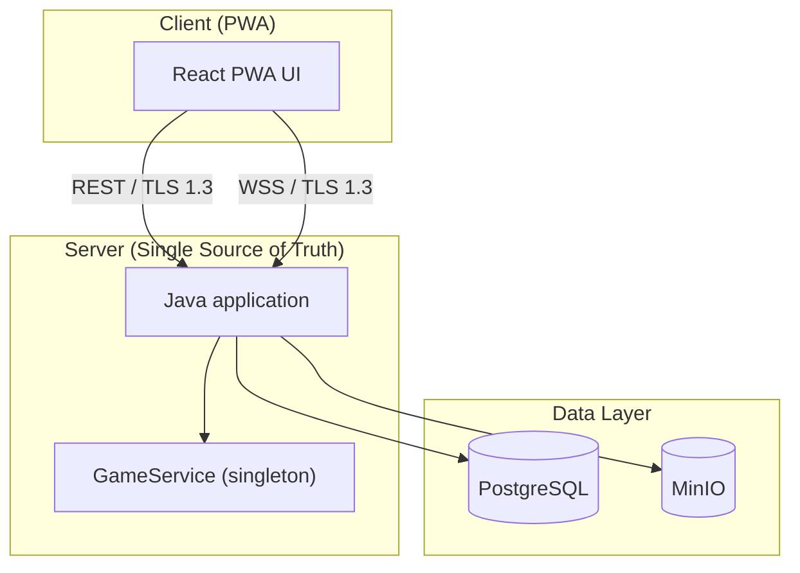
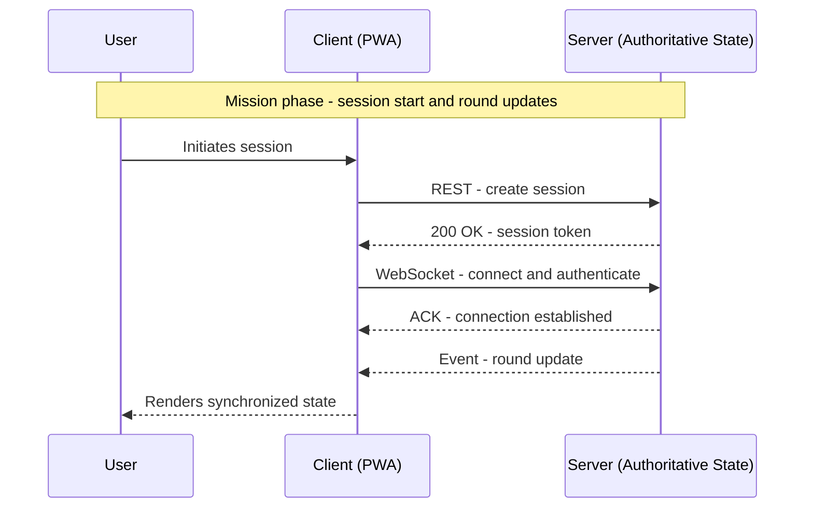

  <h1>Draw It or Lose It</h1>
  
<strong>Strategic Design Directive (SDD)</strong> - Design-first mission package for CS-230

  

    
    
    
  

  
<strong>Primary deliverable:</strong> <a href="./documentation/CS230_Software_Design_Document_TheGamingRoom.pdf">Software Design Document (PDF)</a>

## Mission Brief

| Parameter | Intelligence |
|---|---|
| Primary | [`./documentation/CS230_Software_Design_Document_TheGamingRoom.pdf`](./documentation/CS230_Software_Design_Document_TheGamingRoom.pdf) |
| Client | The Gaming Room |
| Objective | Expand an Android-only title into a cross-platform deployment while maintaining speed, synchronization, and security |
| Architecture | Three-tier architecture with a `PWA` client and a server-side single source of truth |
| Backend | `Java` on `Ubuntu Server 24.04 LTS`, containerized with `Docker`, Kubernetes-ready |
| Data | `PostgreSQL` (structured) and `MinIO` (object storage) |
| Comms | `REST` (setup) and `WebSocket` (real-time), encrypted with `TLS 1.3`, token auth |
| License | `MIT` (see [`./LICENSE`](./LICENSE)) |

> Commander's Intent: Deliver a design directive that is fast to brief, hard to misread, and ready to execute.

### Target Architecture

## Operator and Provenance

| Field | Data |
|---|---|
| Author | Bradley Saucier, SMSgt, USAF (Ret.) |
| Program | B.S. Candidate, Computer Science (STEM Project Management), Southern New Hampshire University |
| Prior education | B.A. Economics, Columbia University; A.A.S., Strategic Operations Management, Community College of the Air Force |
| Repository purpose | Provide the architectural blueprint and rationale for the SDD, plus the supporting citation trail |

## Table of Contents

1. [Mission Brief](#mission-brief)
   - [Target Architecture](#target-architecture)
2. [Operator and Provenance](#operator-and-provenance)
3. [1.0 Situation](#10-situation)
4. [2.0 Mission](#20-mission)
5. [3.0 Execution](#30-execution)
6. [4.0 Sustainment](#40-sustainment)
7. [5.0 Command and Signal](#50-command-and-signal)
8. [6.0 After Action Report and Reflection](#60-after-action-report-and-reflection)
9. [7.0 Deliverables and Directory Layout](#70-deliverables-and-directory-layout)
10. [8.0 Academic Integrity and Citation Policy](#80-academic-integrity-and-citation-policy)
11. [9.0 License and Reuse](#90-license-and-reuse)

## 1.0 Situation

The client, The Gaming Room, required a strategic plan to expand their existing Android game, "Draw It or Lose It," into a web-based, multi-platform application. The primary objective was to maximize market reach and user engagement by making the game accessible across various devices and operating systems without compromising performance or security.

---

Situation summary: The client's asset is confined to the Android ecosystem, limiting its operational reach. Competitors dominate the cross-platform maneuver space across web and iOS platforms. The objective is to break out from the current area of operations.

## 2.0 Mission

Mission statement: Design a scalable, secure, and cross-platform architecture that enables "Draw It or Lose It" to be deployed as a web-based application, capturing a broader user base and establishing a competitive market position.

This repository houses the architectural blueprint and strategic recommendation for transforming a single-platform application into a modern, containerized, multi-tier system. The directive is structured like an operational order - situation, mission, execution, sustainment, and command and signal - so developers and decision-makers can immediately understand both the intent and the plan of action.

---

## 3.0 Execution

### 3.1 Concept of Operations

The operation will be executed by designing a three-tier architecture with a Progressive Web App (PWA) client and a containerized Java backend. The backend will serve as the single source of truth, managing game state via a singleton service.

Reference: See the `Target Architecture` diagram in `Mission Brief`.

### 3.2 Backend

Deploy a `Java` application on `Ubuntu Server 24.04 LTS`, containerized with `Docker` and prepared for `Kubernetes` orchestration.

### 3.3 Frontend

Develop a `PWA` with `React` to ensure maximum compatibility and reach across all target devices (Windows, macOS, iOS, Android).

### 3.4 Communications

Use a stateless `REST` API for standard game setup and a `WebSocket` channel for low-latency, real-time gameplay communication.

## 4.0 Sustainment

| Sustainment line | Directive |
|---|---|
| Data persistence | Utilize `PostgreSQL` for structured data (accounts, scores) and `MinIO` for object storage (drawings, avatars). |
| Logistics | Implement the 3-2-1 backup strategy to ensure data integrity and disaster recovery. |
| Maintenance | Leverage a container-based architecture for simplified updates, scaling, and long-term maintenance. The system is designed for high availability and graceful failure using a `Circuit Breaker` pattern. |

## 5.0 Command and Signal

### 5.1 Command

The `GameService` class, implemented as a singleton, acts as the central command node for all game logic, ensuring state consistency.

### 5.2 Signal

All communications between client and server will be encrypted using `TLS 1.3`. Secure token-based authentication will manage user sessions. The system will be monitored via logs, metrics, and traces to ensure operational awareness.

## 6.0 After Action Report and Reflection

<strong>Expand AAR (lessons learned, proposed revisions, and design rationale)</strong>

 

### 6.1 Client and Requirements Summary

Supported unit: The Gaming Room.  
Mission objective: Expand Draw It or Lose It from a single-platform Android game into a cross-platform, web-based application capable of running on any modern browser and device. The system must support multiple teams and players with unique identifiers, operate in real time, enforce a single authoritative game instance in memory, and maintain speed, security, and consistency across all operating environments.

### 6.2 Strengths in Documentation Development

I approached the SDD as an operational order. The Recommendations section was built with precision and clarity, leaving no ambiguity in execution. The architecture plan specified a containerized Java backend on Ubuntu Server 24.04 LTS, backed by PostgreSQL for structured data and `MinIO` for object storage. The communication plan separated control traffic (`REST`) from real-time updates (`WebSocket`s). Security, scaling, and memory management were detailed to prevent mission drift. Like a mission brief to a pilot, the document provides both the strategic intent and the tactical details required for flawless execution.

### 6.3 The Utility of the Design Document Process

The design document served as the equivalent of a pre-mission plan. It forced deliberate consideration of constraints, dependencies, and contingencies before execution. By mapping out architecture, data flows, and security posture in advance, the risk of mid-operation surprises was reduced. Just as in operational planning, every line in the document was about controlling the battlespace before contact - allocating resources, defining comms, and ensuring synchronization before code was written.

### 6.4 Proposed Revisions

The System Architecture View section needs reinforcement. It currently functions as a high-level foundation; in future iterations, I would add detailed diagrams and flow charts to illustrate inter-component communication under various operational scenarios. This would give the development team an even clearer picture of the timing, dependencies, and control paths.

### 6.5 Translating User Needs into Design

This translation is the most critical phase of design, as software that is technically perfect but fails to solve the user's core problem offers no value.  

The Gaming Room's intent for increased market reach and platform flexibility was translated into a PWA deployment model, ensuring broad accessibility without sacrificing performance or security. Requirements like "unique names" became database-level constraints; "real-time play" translated to a `WebSocket` layer; "security" resulted in end-to-end TLS, short-lived tokens, and OWASP ASVS Level 2 alignment. This is no different from taking a ground commander's intent and turning it into precise coordinates, ingress/egress plans, and weapons release parameters - failure to translate intent correctly equals mission failure.

### 6.6 Design Approach and Future Strategy

My approach followed a structured, top-down methodology: executive summary, requirements, constraints, architecture, domain model, evaluation, and recommendations. This mirrors the formal military planning process - establish the objective, assess the battlespace, plan the maneuver, and define sustainment. For future operations, I would integrate rapid prototyping of high-risk components early in the cycle, similar to a ROC drill, to validate design assumptions and catch integration risks before committing full resources.

---

## 7.0 Deliverables and Directory Layout

| Asset | Path | Purpose |
|---|---|---|
| README | [`./README.md`](./README.md) | This document - the operational wrapper around the SDD |
| SDD (primary deliverable) | [`./documentation/CS230_Software_Design_Document_TheGamingRoom.pdf`](./documentation/CS230_Software_Design_Document_TheGamingRoom.pdf) | Full software design and recommendations |
| CI workflow | [`./.github/workflows/ci.yml`](./.github/workflows/ci.yml) | Continuous integration workflow definition |
| License | [`./LICENSE`](./LICENSE) | MIT license governing reuse |
| References | [`./REFERENCES.md`](./REFERENCES.md) | Standards, specifications, and tools cited |
| Citation metadata | [`./CITATION.cff`](./CITATION.cff) | Machine-readable citation file |

## 8.0 Academic Integrity and Citation Policy

<strong>Academic compliance and citation artifacts (expand)</strong>

All work in this repository is my own, completed in accordance with the Southern New Hampshire University Academic Integrity Policy.  
All external sources, standards, and tools that informed the design are cited in the main PDF document and listed in `REFERENCES.md`.

Artifacts:

  
  

- References: [`./REFERENCES.md`](./REFERENCES.md)
- Citation: [`./CITATION.cff`](./CITATION.cff)

## 9.0 License and Reuse

This project is licensed under the MIT License. See the `LICENSE` file for full details. You are free to use, share, and adapt the content as long as you provide attribution.

End of directive.
